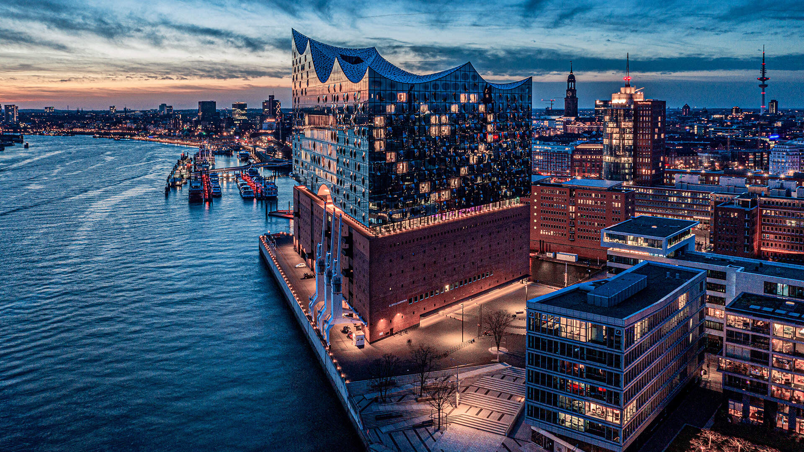

# Awesome Hamburg Guide

🌊 **Hamburg ist keine Stadt, die man nur besucht – Hamburg erlebt man.**  
Zwischen Elbe und Alster trifft frische Seeluft auf Großstadtleben. Hafenkräne, Backsteinfassaden und das Rauschen des Wassers gehören hier genauso dazu wie kreative Viertel und moderne Architektur.

⚓ Die Stadt lebt von Gegensätzen:  
Tradition und Innovation, Ruhe und Trubel, Speicherstadt und Szeneviertel. Ob ein Spaziergang an den Landungsbrücken, ein Kaffee mit Blick aufs Wasser oder ein Abend in St. Pauli – Hamburg hat viele Gesichter.

🎶 Mit Wahrzeichen wie der Elbphilharmonie, einer lebendigen Kulturszene und ihrem internationalen Hafen ist Hamburg weltoffen, ehrlich und nordisch direkt.

❤️ **Für viele ist Hamburg nicht nur eine Stadt – sondern ein Gefühl.**
